# ICN — Indicadores de Análise Regional · Municípios do MS

[](https://github.com/matheusassiso/icn/actions/workflows/render.yml)
[](https://matheusassiso.github.io/icn/)


---

## Dashboard Interativo

[](https://matheusassiso.github.io/icn/icn_dashboard.html)

> [**→ Abrir Dashboard**](https://matheusassiso.github.io/icn/icn_dashboard.html) — mapa coroplético dos 79 municípios, ranking, análise por município e por setor, tabela completa (HTML puro, sem servidor necessário).

Repositório desenvolvido para a disciplina de **Economia Regional e Urbana** (graduação em Economia), com base em:

> MONASTERIO, L. Indicadores de análise regional e espacial. In: CRUZ, B. O. *et al.* (orgs.). **Economia Regional e Urbana: Teorias e métodos com ênfase no Brasil**. Brasília: Ipea, 2011. Cap. 10, p. 315–331.

Os dados são vínculos de **emprego formal agropecuário** (subclasses CNAE) nos **79 municípios do Mato Grosso do Sul** — RAIS/MTE.

---

## Indicadores

| Sigla | Nome | Fórmula | O que mede | Limites |
|-------|------|---------|------------|---------|
| **QL** | Quociente Locacional | $(E_{ki}/E_i)\,/\,(E_k/E)$ | Especialização do município no setor | $[0,\infty)$ |
| **PR** | Participação Relativa | $E_{ki}/E_k$ | Peso do município no setor estadual | $[0,1]$ |
| **IHH** | Hirschman-Herfindahl mod. | $PR_{ki} - s_i$ | Concentração espacial do setor | $[-1,1]$ |
| **ICN** | Concentração Normalizada | ACP(QL, IHH, PR) | Índice síntese via componentes principais | $(-\infty,\infty)$ |

---

## Estrutura

```
icn/
├── R/code.R                      → funções QL(), PR(), IHH(), ICN()
├── data/
│   ├── dados.rds                 → emprego formal agropecuário (79 mun × 46 subclasses)
│   └── ms_municipios_sf.rds      → geometria dos municípios de MS (geobr/IBGE 2020)
├── figures/                      → PNGs gerados pelo Rmd
├── ql_estados_brasil.Rmd         → análise completa
├── .github/workflows/render.yml  → CI/CD → GitHub Pages
└── teer real.Rproj
```

---

## Análise e Resultados

### Visão geral

O estado do Mato Grosso do Sul registrou **57.845 vínculos formais** no emprego agropecuário distribuídos entre 79 municípios e 46 subclasses CNAE. A estrutura setorial é altamente concentrada: **Criação de Bovinos para Corte** responde por 65,3% de todo o emprego formal do setor, seguida de Cultivo de Soja (16,2%) e Cultivo de Cana-de-Açúcar (6,7%). Juntas, essas três atividades representam 88% do total — o restante das 43 subclasses divide os 12% restantes.

---

### Emprego agropecuário por município

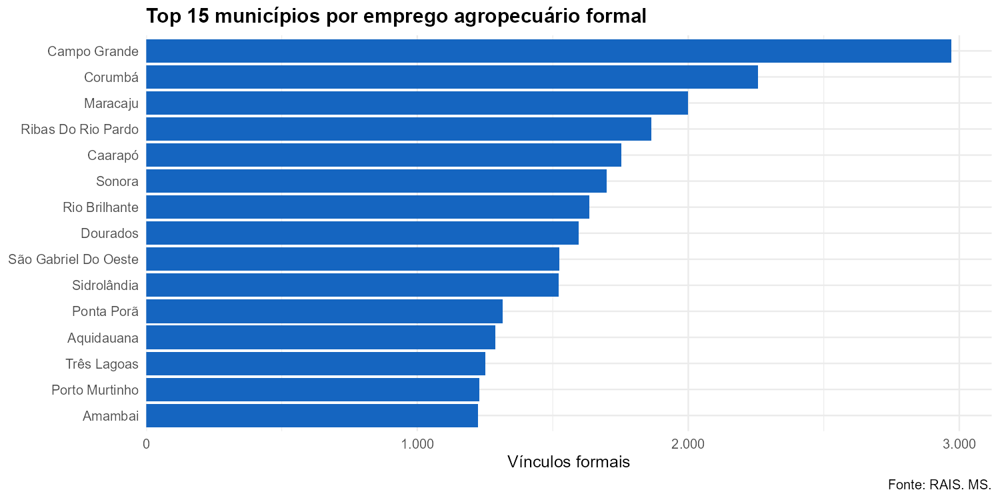

Campo Grande (2.971), Corumbá (2.258) e Maracaju (1.999) concentram os três maiores volumes de emprego formal. A distribuição é heterogênea: os 10 maiores municípios respondem por cerca de 90% do total.

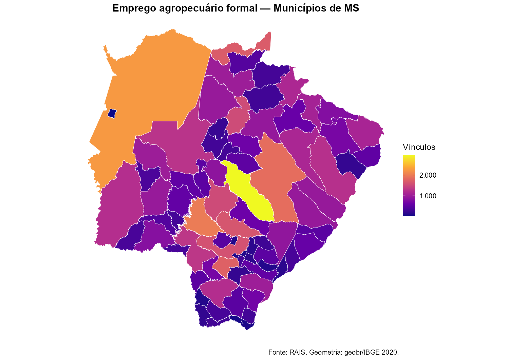

No mapa fica evidente que o emprego agropecuário formal se distribui pelo interior do estado, com destaque para a faixa centro-sul (pecuária e grãos) e o Pantanal ao oeste (Corumbá).

---

### Especialização — Quociente Locacional (QL)

> **QL > 1** significa que o município concentra proporcionalmente mais emprego naquele setor do que a média estadual.

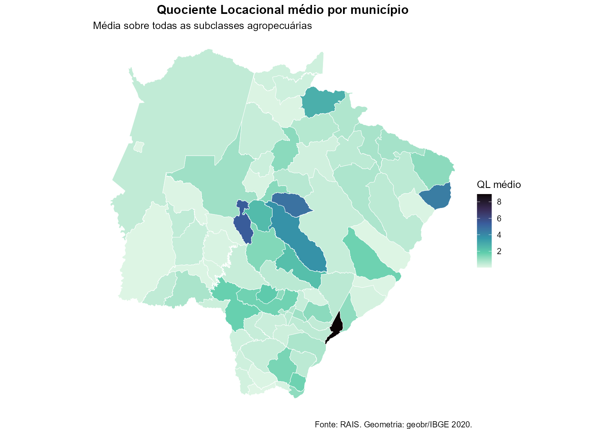

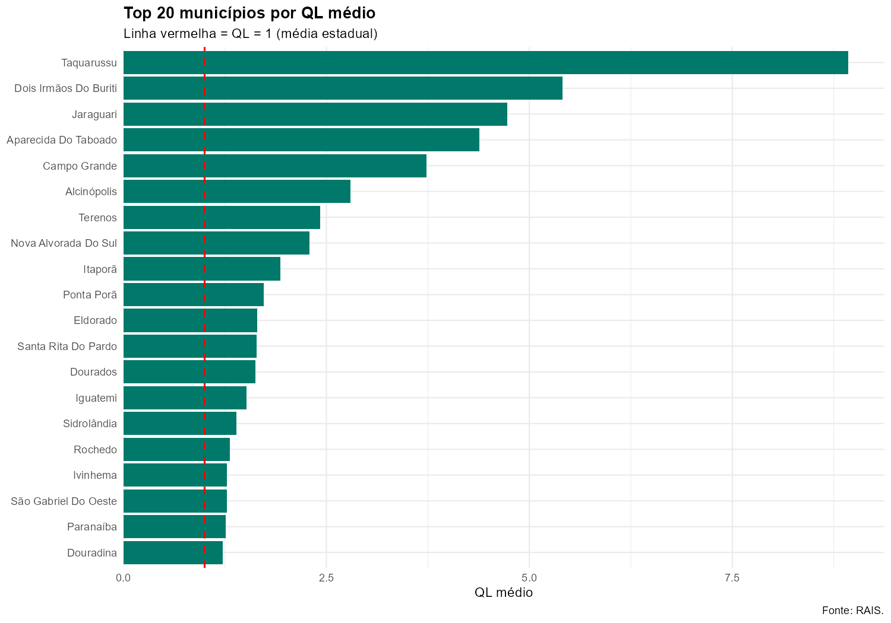

**Taquarussu** apresenta o maior QL médio do estado (8,92), com especialização extrema em Cultivo de Amendoim (QL = 394). É o caso mais atípico: município com apenas 147 vínculos formais no total, mas quase toda a produção estadual de amendoim formal concentrada ali. **Alcinópolis** repete o padrão em Cultivo de Café (QL = 124).

**Jaraguari** (QL médio 4,73; 13 subclasses especializadas) e **Aparecida do Taboado** (QL 4,38; 7 subclasses) se destacam como municípios com especialização diversificada — não dependem de um único setor.

**Campo Grande**, apesar de ser o maior empregador absoluto, tem QL médio de 3,74 com especialização em Cultivo de Pimenta-do-Reino — atividade de nicho que representa quase todo o emprego formal estadual nessa subclasse.

Na ponta oposta, **Ladário**, **Sete Quedas**, **Brasilândia**, **Miranda** e **Porto Murtinho** têm QL médio abaixo de 0,06 — empregam quase exclusivamente em Criação de Bovinos para Corte (atividade dominante no estado), o que resulta em baixíssima especialização relativa.

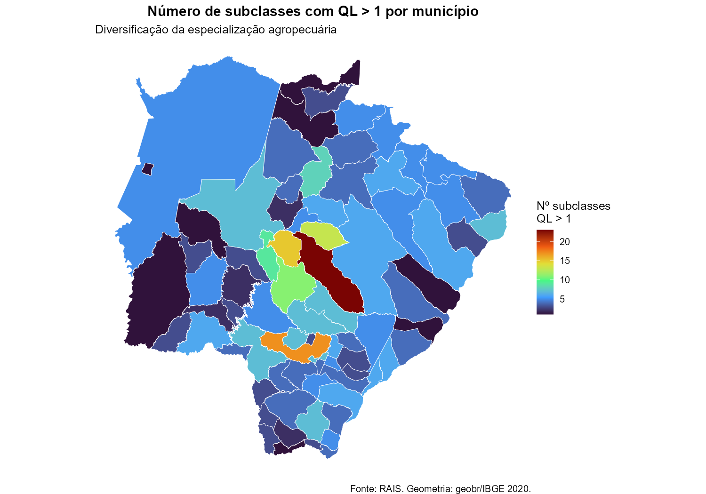

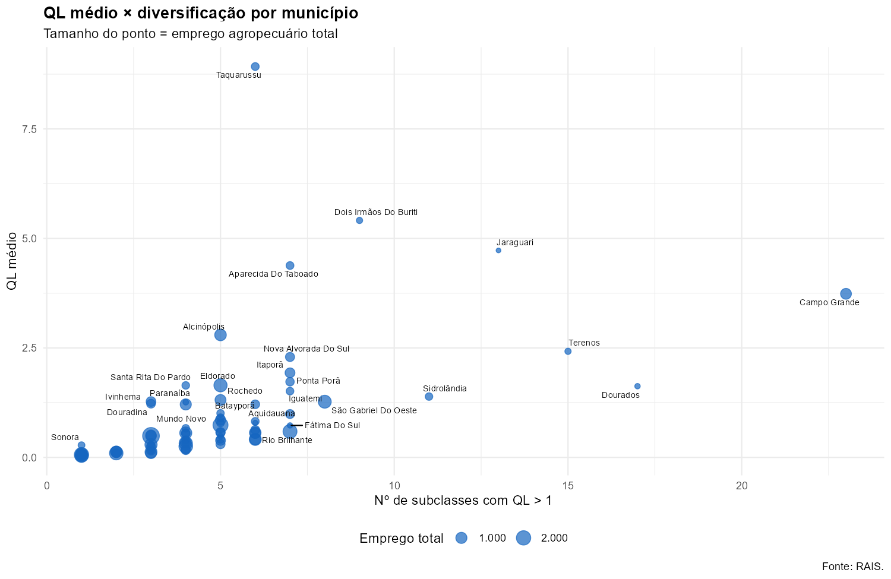

Municípios maiores em emprego absoluto tendem a ter mais setores com QL > 1 (correlação de 0,33), mas o QL médio é praticamente independente do tamanho (correlação –0,001). Ou seja, **especialização e escala são dimensões distintas** no MS agropecuário.

---

### Concentração espacial — IHH

> IHH positivo indica que o setor está mais concentrado naquele município do que o tamanho do município sugere; IHH negativo, o oposto.

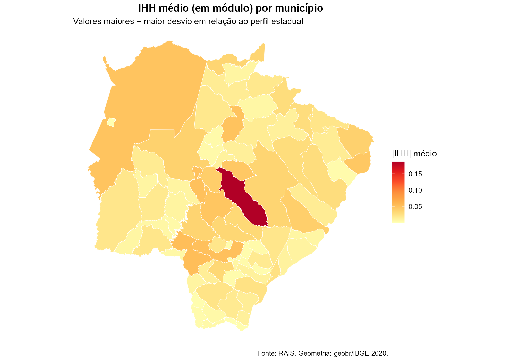

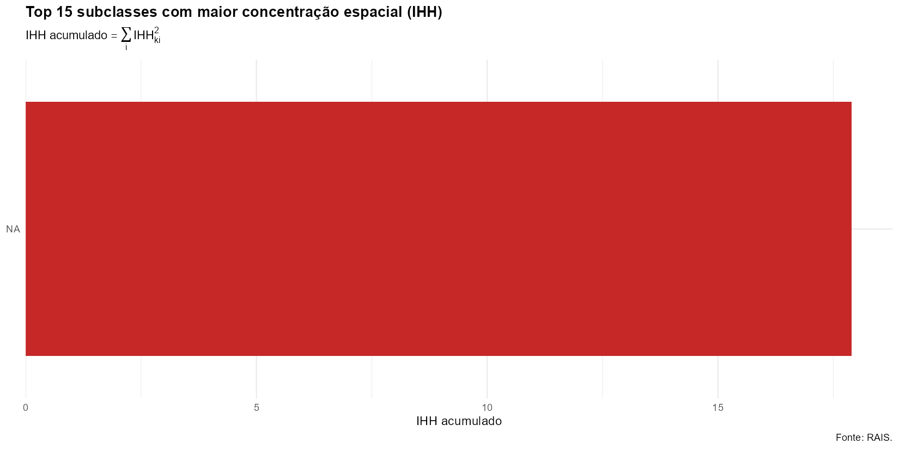

As subclasses com maior concentração espacial são nichos com pouquíssimos municípios produtores: **Cultivo de Amendoim** (IHH acumulado 1,01 — virtualmente monopólio de Taquarussu), **Cultivo de Cebola** (1,00 — Jaraguari), **Cultivo de Plantas para Condimento** (0,999 — Nova Alvorada do Sul) e **Cultivo de Melancia** (0,988 — Santa Rita do Pardo).

No lado dos municípios, **Campo Grande** se destaca com |IHH| médio de 0,188 — bem acima do segundo colocado, Ponta Porã (0,053). Campo Grande é simultaneamente o maior empregador e o município com maior desvio em relação à participação esperada: está over-representado em muitos nichos ao mesmo tempo.

---

### Participação Relativa (PR)

> PR mede a fatia do município no emprego estadual de cada setor — independente de especialização.

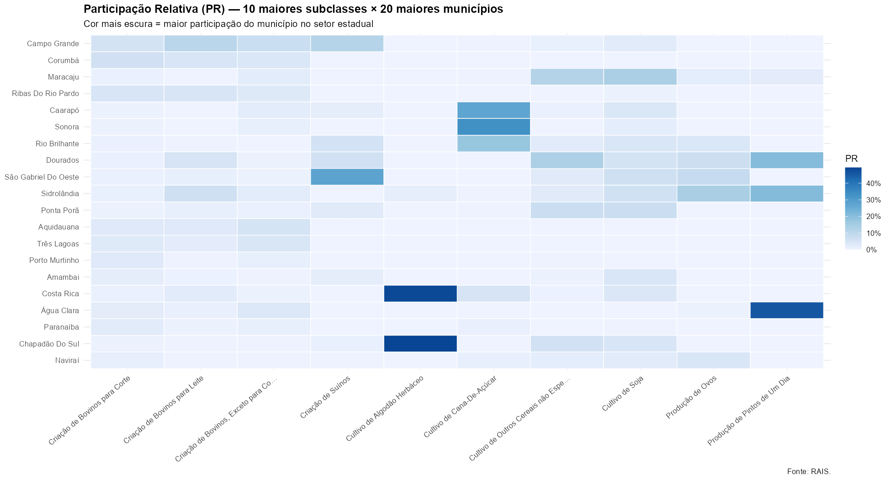

Para os setores dominantes: Corumbá responde pela maior parcela do emprego formal em pecuária bovina de corte; Maracaju e Rio Brilhante lideram em soja; Caarapó e Sonora concentram cana-de-açúcar.

---

### Índice de Concentração Normalizada (ICN)

> ICN combina QL, PR e IHH via análise de componentes principais com rotação Varimax — sintetiza as três dimensões num único índice comparável entre setores (Monasterio, 2011, Cap. 10).

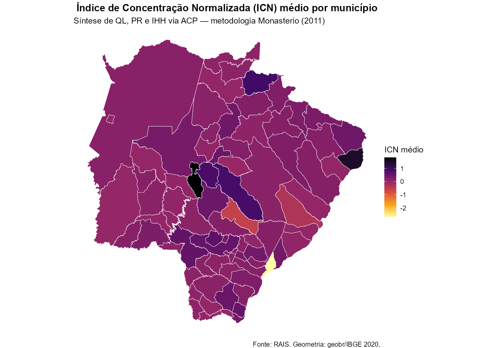

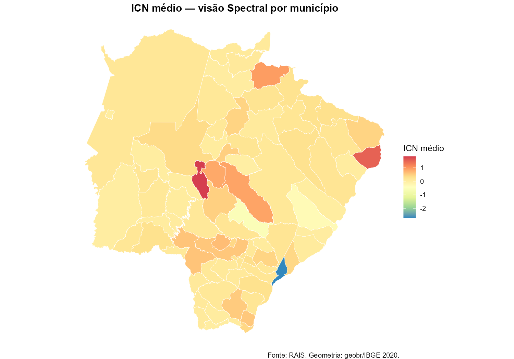

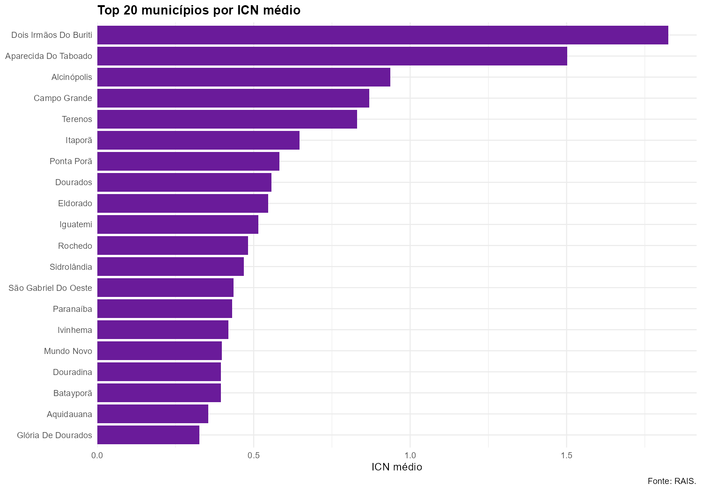

O ICN confirma e reforça os achados do QL: **Taquarussu**, **Alcinópolis** e **Jaraguari** lideram o ranking de concentração normalizada. O índice captura tanto a intensidade da especialização (QL alto) quanto o peso relativo dentro do estado (PR) e o desvio em relação ao esperado (IHH) — por isso é o indicador mais completo dos três.

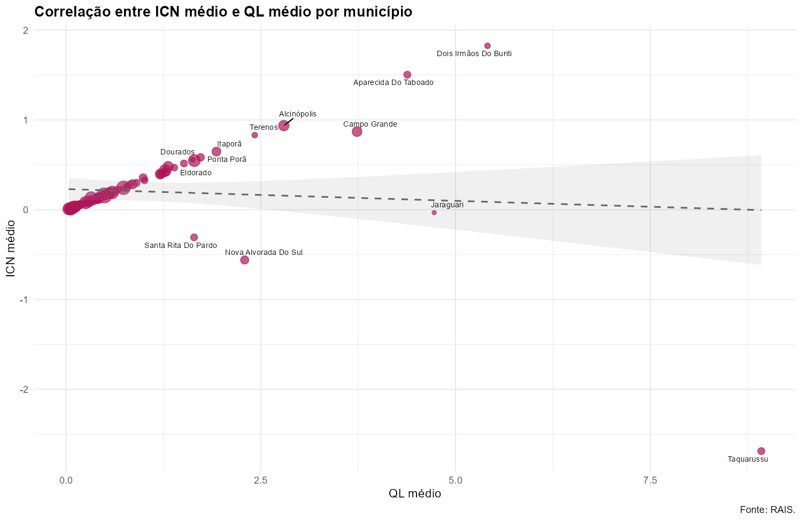

A correlação entre ICN médio e QL médio é forte e positiva: municípios que se especializam (QL > 1) em nichos específicos tendem a ter IHH alto e PR concentrado naquelas subclasses — o que empurra o ICN para cima.

---

### Painel: perfil dos maiores municípios

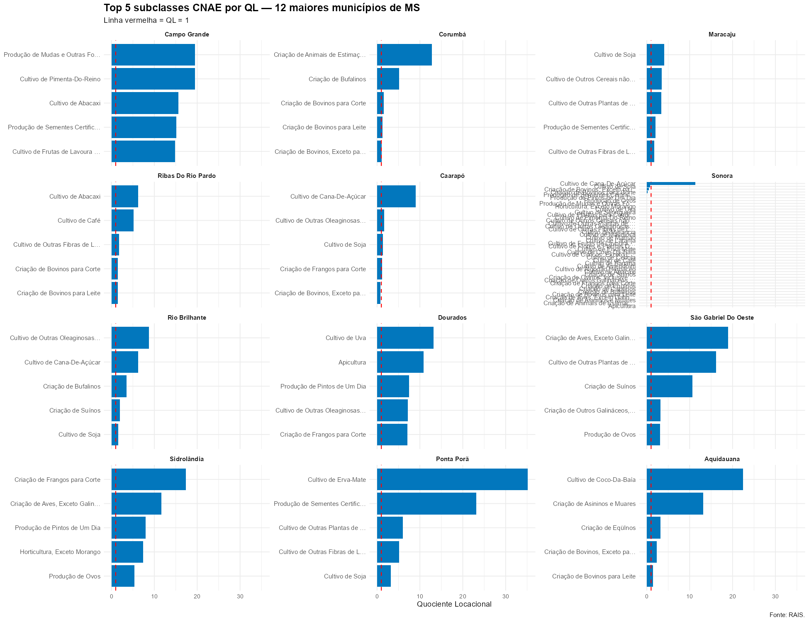

O painel mostra os 5 setores de maior QL em cada um dos 12 maiores municípios por emprego. Fica claro o contraste entre:
- **Municípios de nicho** (Taquarussu, Alcinópolis): um setor com QL extremo domina todo o perfil.
- **Municípios diversificados** (Campo Grande, Dourados, Jaraguari): vários setores com QL moderado, indicando base produtiva mais ampla.
- **Municípios bovino-dependentes** (Corumbá, Porto Murtinho, Miranda): QL próximo de 1 em bovinos e perto de zero no resto — estrutura pouco diferenciada.

---

### Síntese

| Achado | Evidência |
|--------|-----------|
| Pecuária bovina domina o emprego formal | Bovinos para corte = 65% dos vínculos |
| Especialização e tamanho são independentes | Correlação QL × emprego ≈ 0 |
| Nichos altamente concentrados geograficamente | Amendoim (Taquarussu), Café (Alcinópolis), Cebola (Jaraguari) |
| Campo Grande é anomalia: grande e especializado | Maior empregador e maior IHH médio |
| Municípios pantaneiros têm baixíssima especialização | QL ≈ 0 exceto em bovinos |

---

## Como reproduzir

```r
# Instalar pacotes (apenas na primeira vez)
install.packages(c(
  "tidyverse", "readxl", "writexl", "psych", "sf",
  "viridis", "scales", "patchwork", "ggrepel",
  "knitr", "kableExtra", "RColorBrewer"
))

# Renderizar (com o projeto aberto no RStudio)
rmarkdown::render("ql_estados_brasil.Rmd")
```

---

## Referências

MONASTERIO, L. Indicadores de análise regional e espacial. In: CRUZ, B. O. *et al.* (orgs.). **Economia Regional e Urbana: Teorias e métodos com ênfase no Brasil**. Brasília: Ipea, 2011. Cap. 10.

PEREIRA, R. H. M. *et al.* **geobr**: Loads Shapefiles of Official Spatial Data Sets of Brazil. <https://github.com/ipeaGIT/geobr>.

RAIS — Relação Anual de Informações Sociais, 2020. MTE. <http://pdet.mte.gov.br/>.
